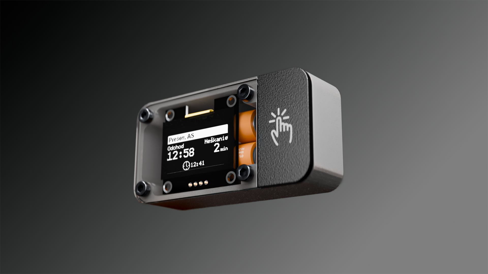
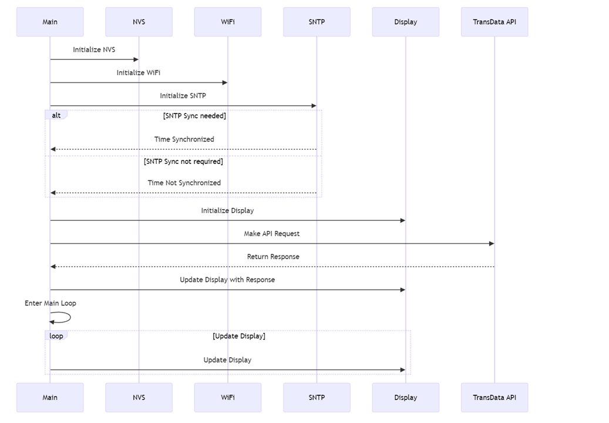

<picture>
	
</picture>

# GdeBus
GdeBus is an IoT project designed to display bus departures at public transport stops.

#### Flow diagram

Flow diagram showing the system's operation sequence from button press through data updates to display refresh.

#### Sequence diagram

> Title image - Designed in Fusion360, rendered in Blender